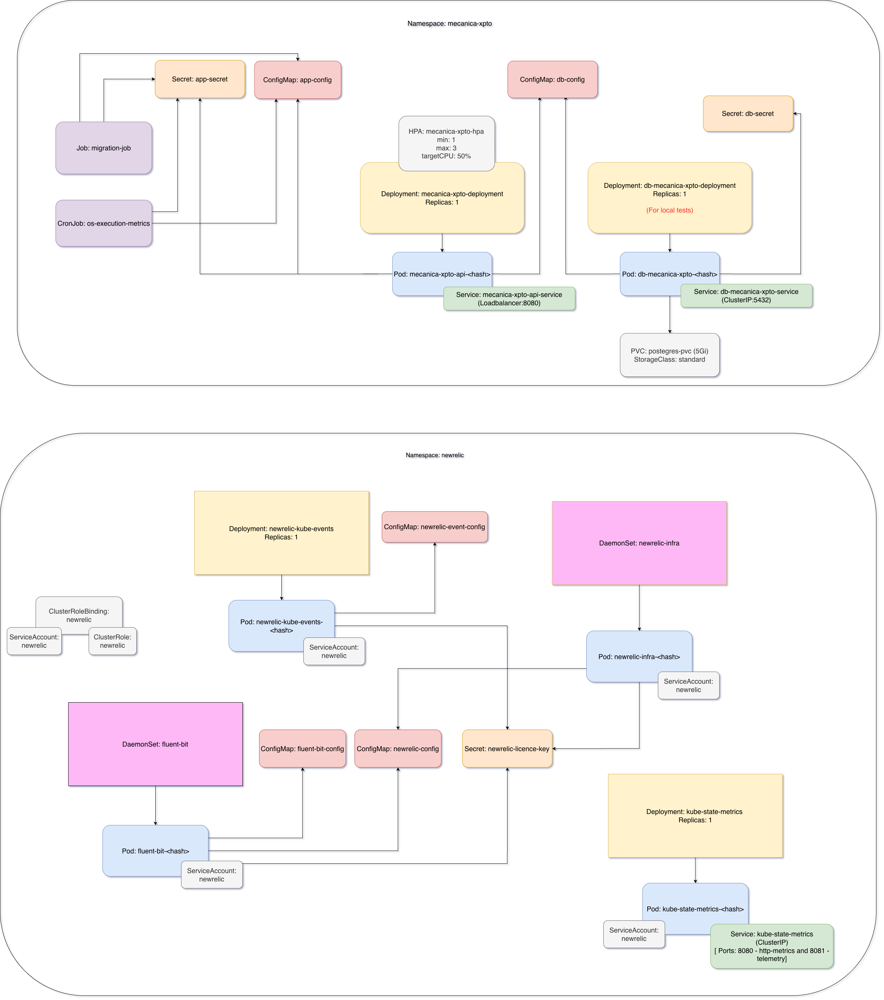
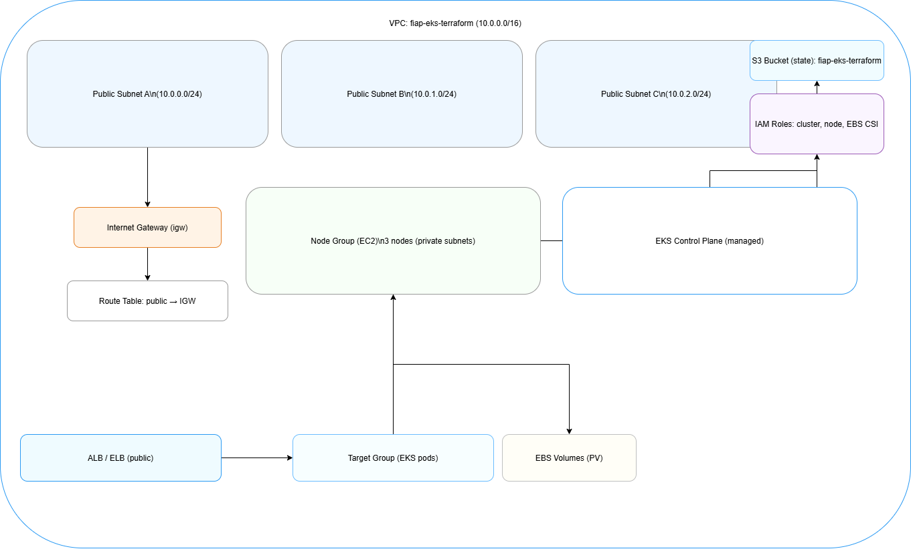
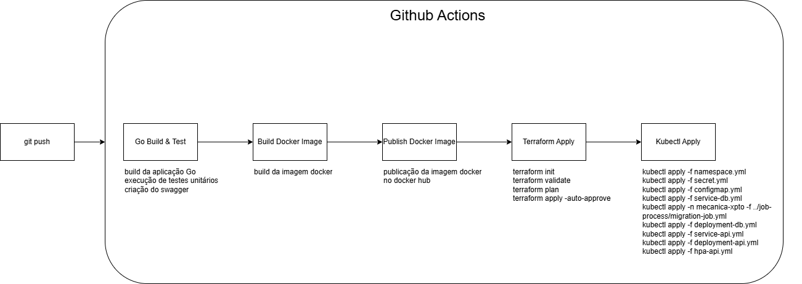
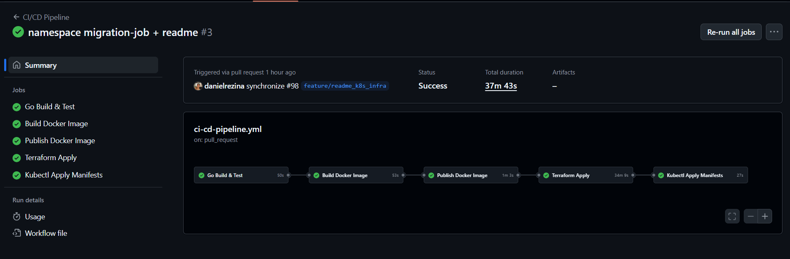
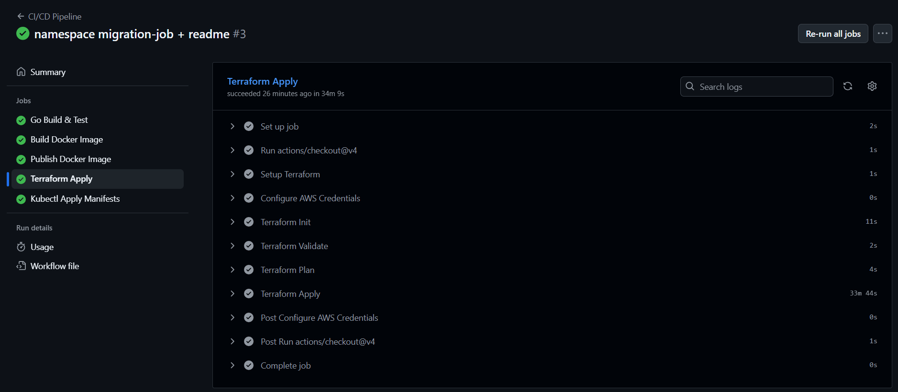
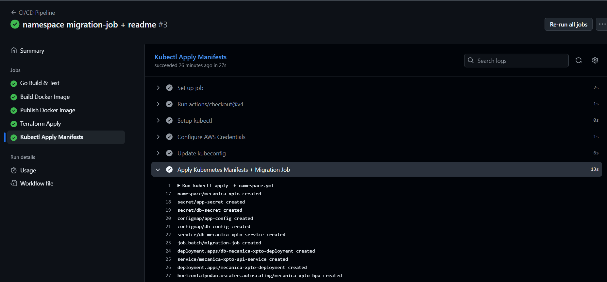

# infrastructure-os-service-api

## Descrição

Este projeto visa criar uma infraestrutura para hospedar a API da Mecanica XPTO.

## Tecnologias utilizadas 

- Terraform (Plataforma de Infraestrutura como Código)
- AWS EKS (Plataforma de Container Orquestração)
- GitHub Actions (Plataforma de Integração Contínua)

## Arquitetura da Infraestrutura

- Componentes do Kubernetes


- AWS EKS


## Como provisionar a infraestrutura na AWS

### Pré-requisitos

- **AWS CLI:** Configurado com um perfil para autenticação.
- **Terraform:** Certifique-se de que a versão instalada seja compatível com os provedores declarados (`~> 4.0`).

### Configuração Inicial

1. **Configurar o AWS CLI:**
   Configure o perfil de autenticação com as credenciais apropriadas para provisionar a infraestrutura na região `us-east-1` juntamente com uma `access_key` e uma `secret_key`.

   ```bash
   aws configure
   ```

2. **Configurar o backend do Terraform:**
  Configure o backend do Terraform baixando as dependências do Terraform.

    ```bash
   terraform init
   ```

3. **Executar o Plan:**
   Execute o comando plan para caso queira verificar as alterações que serão feitas na infraestrutura ou para confirmar que a infraestrutura está de acordo com o que foi declarado no Terraform.

   ```bash
   terraform plan
   ```

4. **Executar o Apply:**
   Execute o comando apply para provisionar a infraestrutura.

   ```bash
   terraform apply
   ```

5. **Apontar cluster EKS:**
   Execute o comando update-kubeconfig para apontar o cluster EKS.

   ```bash
   aws eks update-kubeconfig --region us-east-1 --name eks-fiap-eks-terraform
   ```

6. **Executar o Destroy: (Caso necessário)**
   Execute o comando destroy para destruir a infraestrutura.

   ```bash
   terraform destroy
   ```

Para fazer os testes da aplicação utilizando o dominio da API, execute o comando abaixo para obter o IP da API:

```bash
kubectl get svc -n mecanica-xpto
```
Basta usar o DNS público do ELB retornado pelo Kubernetes (EXTERNAL-IP).

URL:

```
http://<EXTERNAL-IP>.us-east-1.elb.amazonaws.com:8080/v1/{rota}
```

### Infraestrutura da API
```bash
make deploy // Deploy da API
make get-all // Checa o status da API
make run-jobs // Executa os jobs da API
```

### Infraestrutura do New Relic
```bash
make deploy-newrelic // Deploy do New Relic
make get-newrelic // Checa o status do New Relic
```

- Para desprovisionar a execução da API e do New Relic, execute os comandos abaixo:

- API
```bash
make delete
```

- New Relic
```bash
make delete-newrelic
```

## CI/CD

O projeto possui um pipeline CI/CD automatizado via GitHub Actions, que executa as seguintes etapas:

1. **Go Build & Test:** Compila e executa os testes automatizados do backend.
2. **Docker Build:** Constrói a imagem Docker da aplicação.
3. **Docker Push:** Publica a imagem no Docker Hub.
4. **Terraform Apply:** Provisiona/atualiza a infraestrutura na AWS (EKS, VPC, etc).
5. **Kubectl Apply:** Aplica os manifestos Kubernetes no cluster EKS, garantindo a ordem correta dos recursos.

O pipeline é disparado automaticamente após o Merge Pull Request para as branches `main`

**Principais arquivos do pipeline:**
- `.github/workflows/ci-cd-pipeline.yml`: Pipeline unificado com todas as etapas.

---
### Diagrama do fluxo CI/CD




